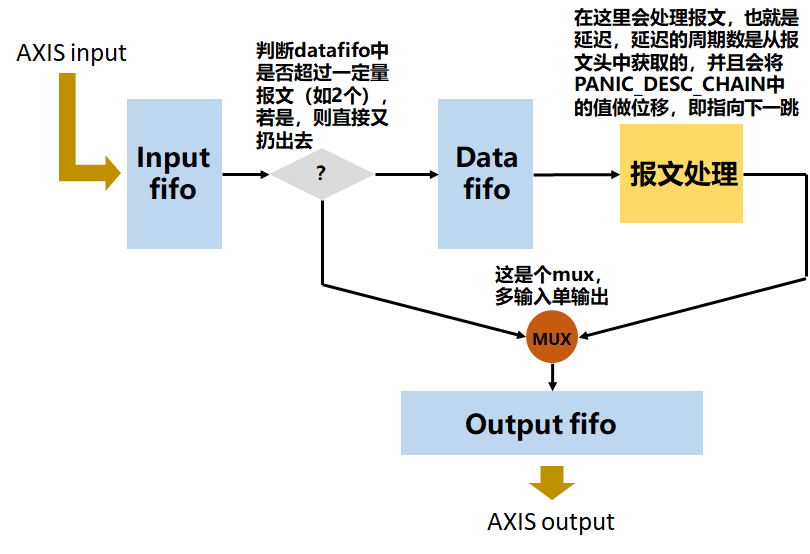

从功能上，compute_engine.v实现一个延迟，是简单的，作为入手调试对象比较合适

它依赖于panic_define.v用于定义一些常量，依赖于 alex写的axis模块（存放在/lib/axis中）

delay unit的总体架构如下图所示：

输入的报文要求是两个节拍以上的数据，其中第一个节拍是panic_descriptor。

**在处理报文头时，会对PANIC_DESC_CHAIN的内容进行修改，以指向下一跳。如果处理链条已经为空，即不在需要经过compute unit，那么可以直接出panic。由于dma engine处于switch的1号端口，所以tdest被设置为1。这个是所有的compute unit都共同遵守的规则。**

