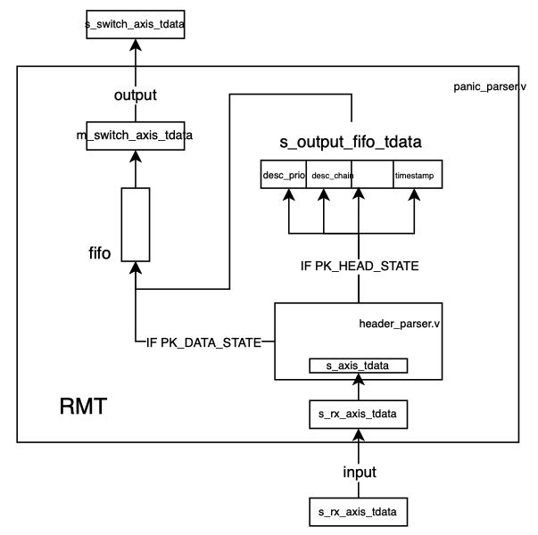

PANIC中并没有实现复杂的RMT功能，不是可重配置的，match后的action动作硬编码在header_parser.v文件中，目前支持4种动作，仅支持UDP报文。用来match的字段是UDP报文中源端口字段。

PANIC的入口，主要包含两个文件，panic_parser.v和header_parser.v

首先在panic.v中例化panic_parser.v，通过s_rx_axis_tdata作为输入，经过解析后输出到s_switch_axis_tdata。
在panic_parser.v 中

1. 将s_rx_axis_tdata输入到header_parser.v的s_axis_tdata进行包头分析。生成优先级、卸载链等descriptor
2. 根据parser_state == PK_DATA_STATE / PK_HEAD_STATE , 如果是PK_HEAD_STATE则将解析的包头数据覆盖s_output_fifo_tdata
   （实际上的逻辑是一个包头接着一个数据包即初始化parser_state为PK_HEAD_STATE，收到一个数据包后设置为PK_DATA_STATE，然后再设置回PK_HEAD_STATE）
3. s_output_fifo_tdata写入fifo，输出为m_switch_axis_tdata

